# Multi-Environment Infrastructure Design using Terraform

##  Project Overview

This project demonstrates how to provision and manage a multi-environment AWS infrastructure using Terraform.

The infrastructure includes:

- VPC
- EC2 Instance
- Security Groups
- S3 Bucket (Application Storage)
- Remote Backend using S3
- Environment Isolation using Workspaces
- Modular Terraform Architecture

Environments:

- Dev → Small instance
- Staging → Medium instance
- Production → Large instance + Extra security rules

---
# Project Architecture Diagram
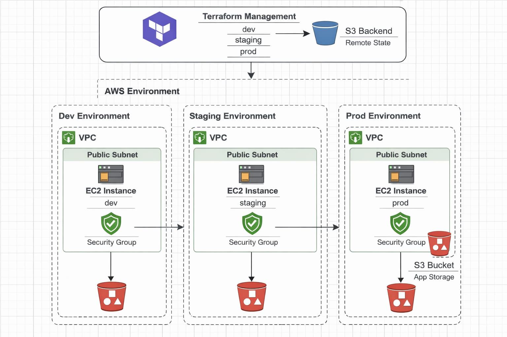
---

#  Project Structure

```
Terraform-Multi-Environment-Infrastructure/
│
├── main.tf
├── variables.tf
├── outputs.tf
├── backend.tf
│
├── modules/
│   ├── vpc/
│   │   ├── main.tf
│   │   ├── variables.tf
│   │   └── outputs.tf
│   │
│   ├── ec2/
│   │   ├── main.tf
│   │   ├── variables.tf
│   │   └── outputs.tf
│   │
│   ├── security_group/
│   │   ├── main.tf
│   │   ├── variables.tf
│   │   └── outputs.tf
│   │
│   └── s3/
│       ├── main.tf
│       ├── variables.tf
│       └── outputs.tf
│
└── env/
    ├── dev.tfvars
    ├── staging.tfvars
    └── prod.tfvars
```

---

#  Technologies Used

- Terraform
- Amazon EC2
- Amazon VPC
- Amazon S3

---

#  Workspace Strategy

Separate Terraform workspaces are used for each environment:

```
 dev
 staging
 prod
```

Each workspace maintains:

- Separate state file
- Separate infrastructure
- Proper isolation

---

#  Remote Backend Setup

State is stored in S3:

```
terraform {
  backend "s3" {
    bucket  = "terraform-state-bucket-akshay"
    key     = "multi-env/${terraform.workspace}/terraform.tfstate"
    region  = "ap-south-1"
    encrypt = true
  }
}
```

Benefits:

- Remote state management
- Safe collaboration
- Environment isolation
- Production safety

---

#  Infrastructure Differences Per Environment

| Environment | EC2 Type | Security Rules |
|------------|----------|----------------|
| Dev | t2.micro | HTTP + SSH |
| Staging | t2.small | HTTP + SSH |
| Production | t2.medium | HTTP + Restricted SSH |

---
##  Resource Tagging

All resources are tagged:

```
tags = {
  Environment = var.environment
}
```

Helps in cost tracking and environment identification.

---

#  Deployment Steps

## Step 1: Initialize Terraform

```
terraform init
```
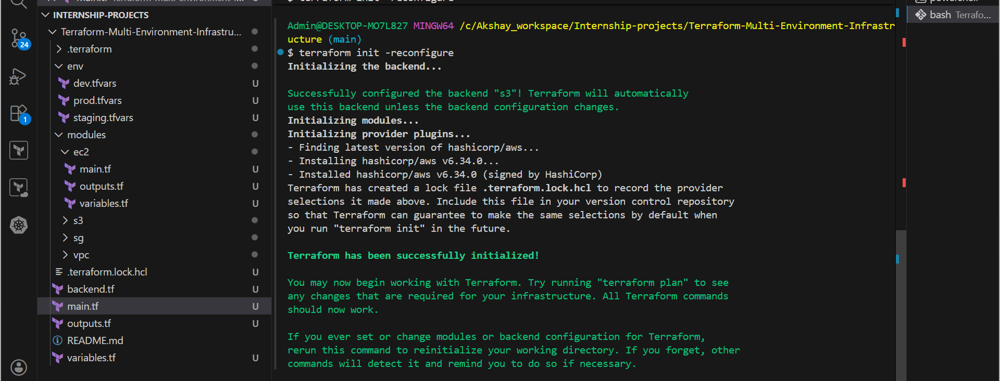

## Step 2: Create Workspaces

```
terraform workspace new dev
terraform workspace new staging
terraform workspace new prod
```
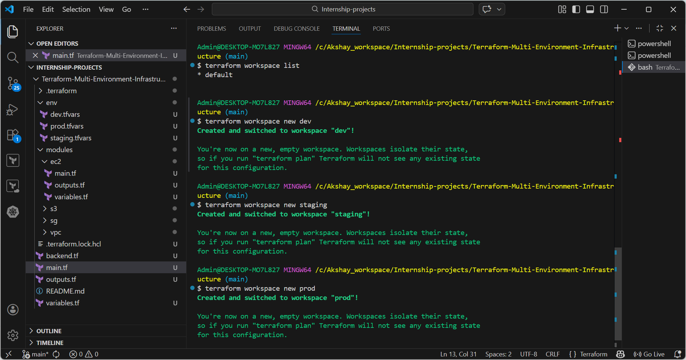

## Step 3: Deploy Dev

```
terraform workspace select dev
terraform plan -var-file="env/dev.tfvars"
terraform apply -var-file="env/dev.tfvars"
```
#### **plan:**
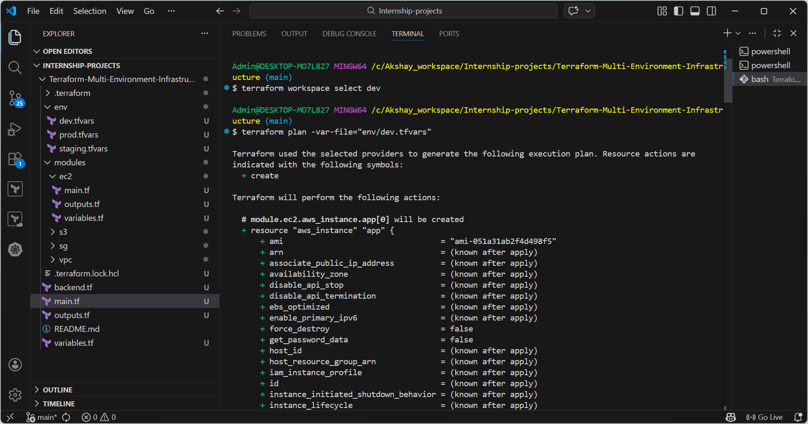
#### **Apply:**
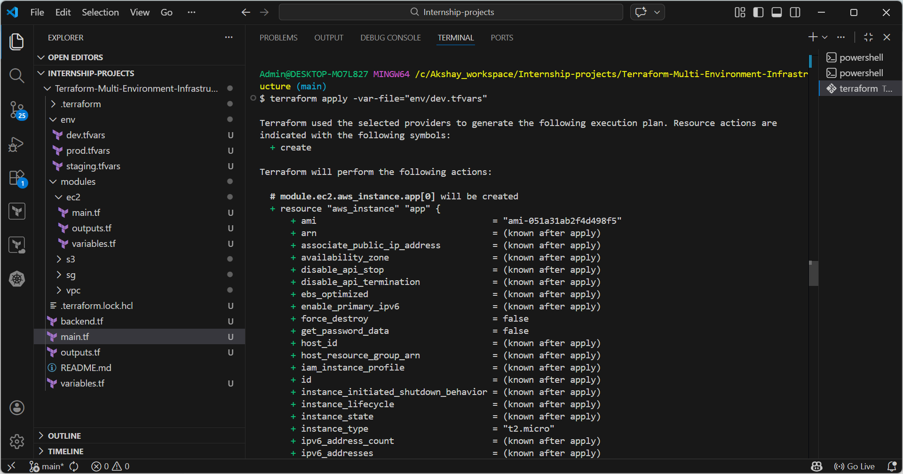

## Step 4: Deploy Staging

```
terraform workspace select staging
terraform plan -var-file="env/staging.tfvars"
terraform apply -var-file="env/staging.tfvars"
```
#### **plan:**
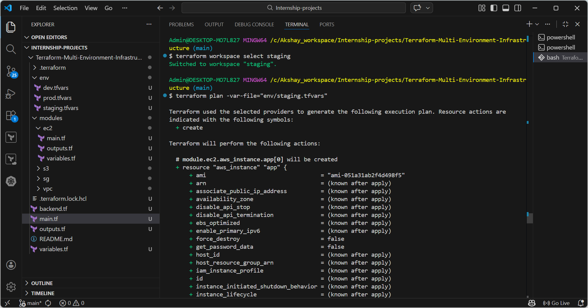
#### **Apply:**
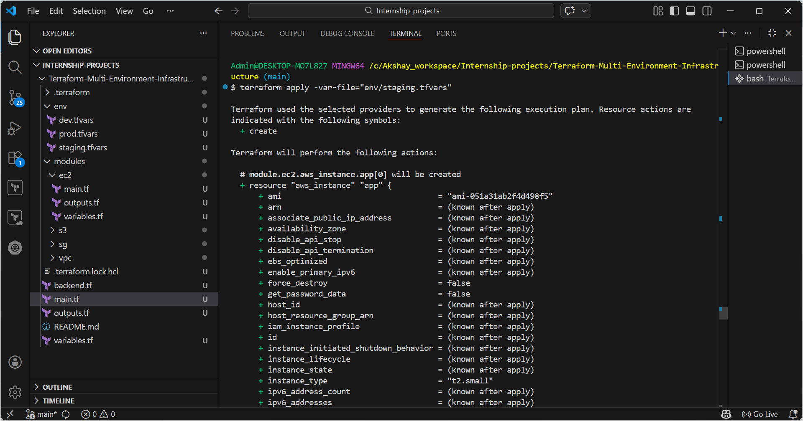

## Step 5: Deploy Production

```
terraform workspace select prod
terraform plan -var-file="env/prod.tfvars"
terraform apply -var-file="env/prod.tfvars"
```
#### **plan:**
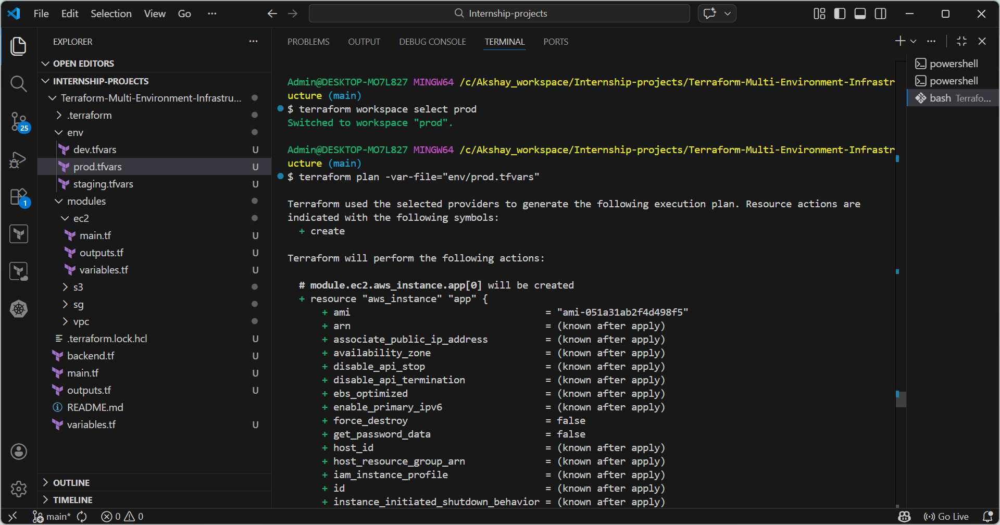
#### **Apply:**
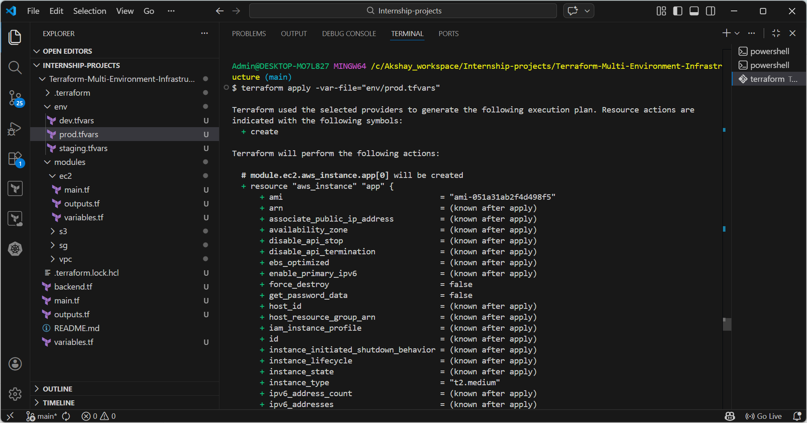

## step 6: Destroy Environment
#### **Dev:**
```
terraform workspace select dev
terraform destroy -var-file="env/dev.tfvars"
```
#### **Staging:**
```
terraform workspace select staging
terraform destroy -var-file="env/staging.tfvars"
```
#### **Prod:**
```
terraform workspace select prod
terraform destroy -var-file="env/prod.tfvars"
```
---

#  Environment Validation

Isolation verified by:

- Different EC2 instance types
- Separate state files in S3
- Environment-based tags
- Destroying one workspace does not affect others

---

#  Screenshots

> Save all screenshots inside the `images/` folder.

## 1️. Workspace List

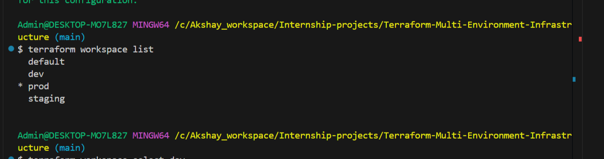

## 2. Ec2 instances
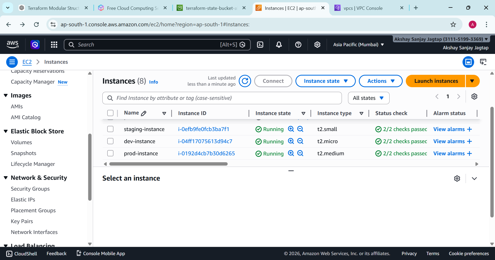

####  **Dev Environment (EC2)**

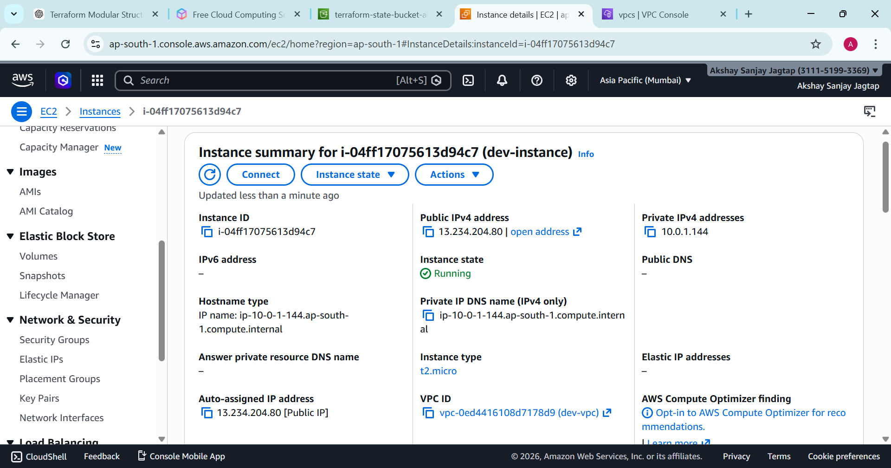

####  **Staging Environment (EC2)**

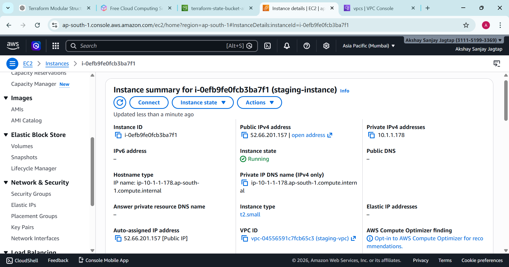

####  **Production Environment (EC2)**

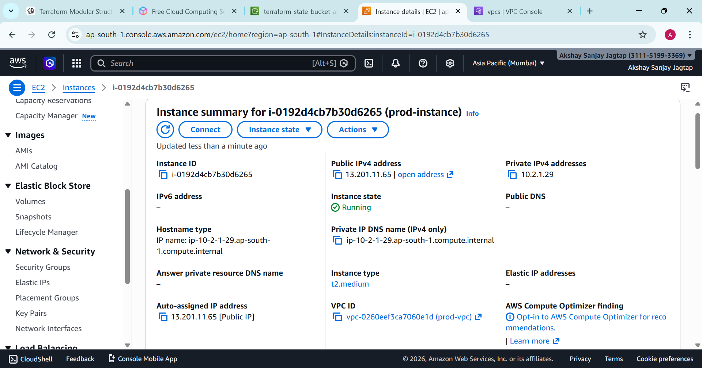

## 3. Security Groups
#### **Dev:**
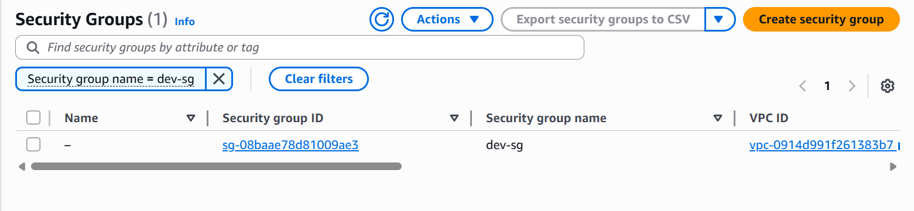
#### **Staging:**
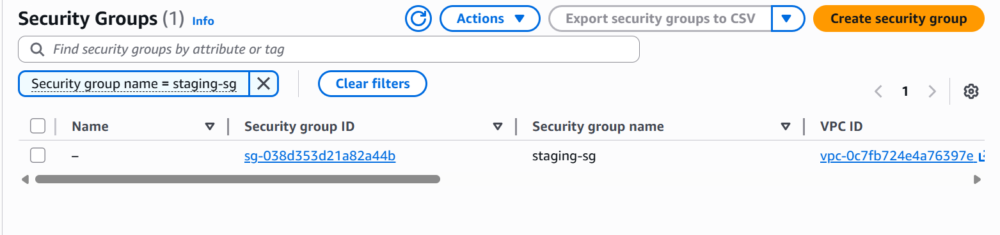
#### **prod:**
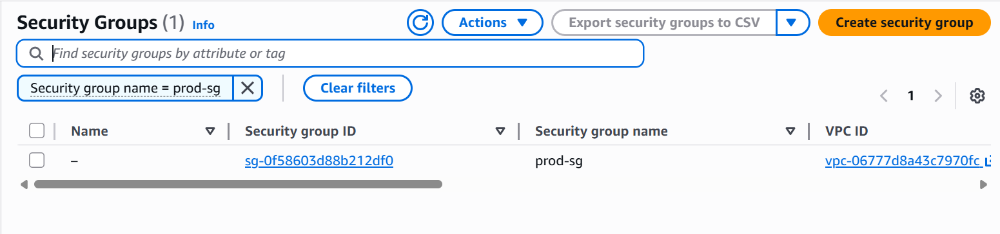

## 4. Vpc's
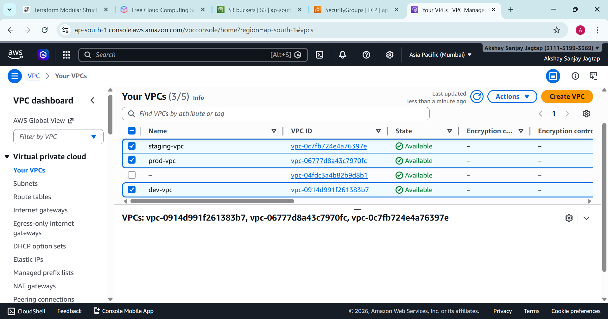

## 5. S3 App Buckets
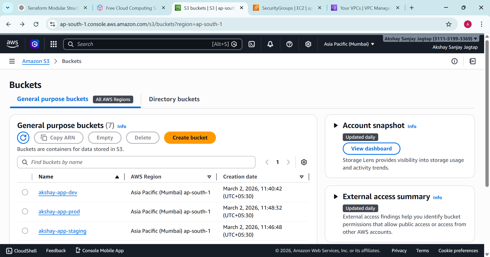

## 6. S3 Remote State Files Bucket

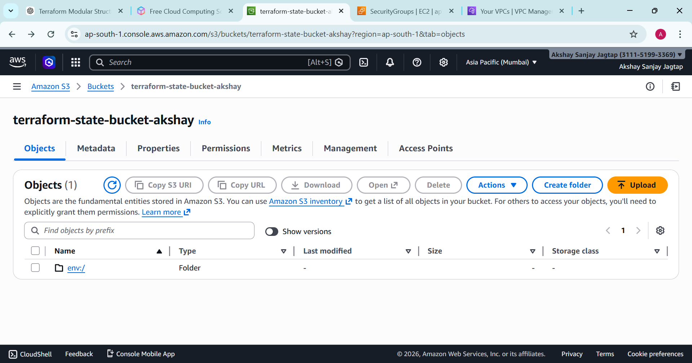

```
terraform-state-bucket-akshay
└── env/
    ├── dev/
    │   └── multi-env/
    │       └── terraform.tfstate
    ├── staging/
    │   └── multi-env/
    │       └── terraform.tfstate
    └── prod/
        └── multi-env/
            └── terraform.tfstate

```
#### **Dev:**
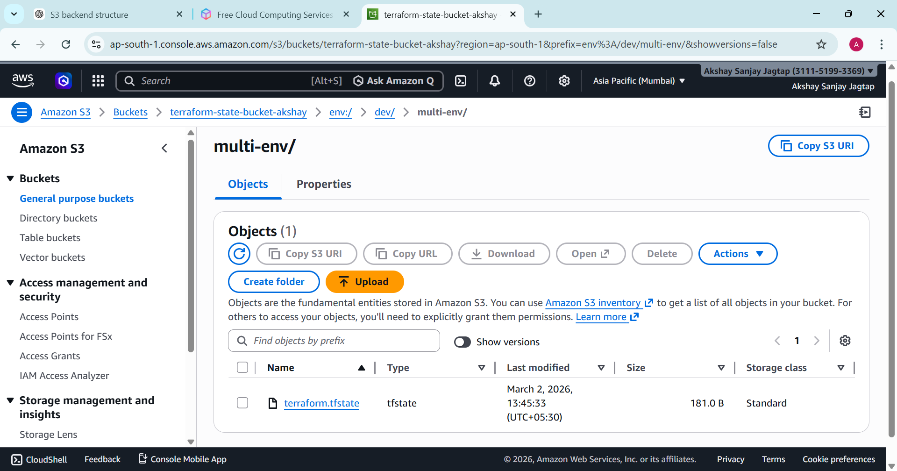

#### **Staging:**


#### **Prod:**
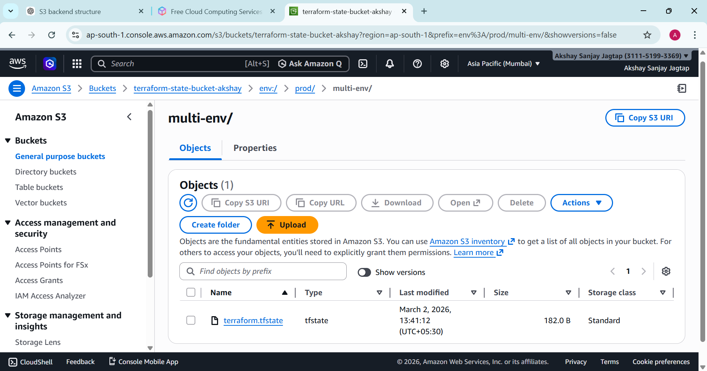

---

#  Deliverables

- Modular Terraform Code
- Workspace Setup Proof
- Screenshots of 3 Environments
- Remote Backend Configuration
- Environment Isolation Demonstration
- Production Safety Configuration

---

#  Key Learning Outcomes

- Modular Infrastructure Design
- Multi-Environment Strategy
- Terraform Workspaces
- Remote Backend Configuration
- Production-Level Safety Practices
- Infrastructure Isolation

---

#  Conclusion

This project demonstrates a scalable and production-ready Terraform architecture with:

- Clean modular design
- Secure remote state management
- Environment isolation
- Production protection
---
## Author: 
#### Akshay Jagtap